**Lab 8 - 自动机器学习系统练习 – 实验结果**

**目录说明：**

实验结果**共2个部分**，包括手动调参和NNI自动调参。

（1）image目录：实验结果截图。NNI实验中更详细的实验结果请看**实验报告**或者resources文件夹里的运行输出文件。

（2）src目录：存放代码，共4套（手动调参1套，NNI自动调参3套）

*手动调参* 代码每次运行除参数外无其他变化。

*NNI自动调参*
则进行了三次（具体不同和其他信息请看实验报告），搜索空间文件和参数设置都有不同。

（3）resources目录：存放每次实验结束后输出的结果文件（包括日志等），**实验报告中有完整的总结。**

%%%%%%%%%%%%%%%%%%%%%%%%%%%%%%下面是实验报告%%%%%%%%%%%%%%%%%%%%%%%%%%

实验报告

Lab 8 - 自动机器学习系统练习

**一，实验环境**

**本机：**

**硬件环境**

CPU（vCPU数目） ： AMD Ryzen 7 4800H

GPU(型号，数目) ： NVIDIA GeForce RTX 2060

**软件环境**

OS版本 ： Ubuntu 16.04 LTS

深度学习框架 ： PyTorch 1.5.0

python包名称及版本 ： Python 3.7.6

CUDA版本 ： CUDA 10.1, CuDNN 7.6

**Bitahub环境：**

**硬件环境**

CPU（vCPU数目） ： 2 vCPUs

GPU(型号，数目) ： GTX 1080ti \*2 or TITAN Xp \*2

**默认软件环境**

OS版本 ： Ubuntu 16.04 LTS

深度学习框架 ： PyTorch 1.3

python包名称及版本 ： Python 3.6

CUDA版本 ：

CUDA_PKG_VERSION=10-0=10.0.130-1

CUDA_VERSION=10.0.130

>   CUDNN_VERSION=7.4.2.24

**使用的nni镜像软件环境**

NNI v1.8 form：msranni/nni (docker.com)

OS版本 ： Ubuntu 16.04 LTS

深度学习框架 ： PyTorch 1.5.0

python包名称及版本 ： Python 3.7.6

CUDA版本 ： CUDA 10.1, CuDNN 7.6

**二，实验结果**

1.记录不同调参方式下，cifar10程序训练结果的准确率。

**原始代码**

[src\\手动调参代码\\hpo\\main.py](src/手动调参代码/hpo/main.py)

[src\\手动调参代码\\hpo\\utils.py](src/手动调参代码/hpo/utils.py)

（实验提供的原始代码）

**手动调参任务：**

说明：

由于缺少经验，不了解各个超参数之间的组合关系（比如某种超参数组合可能比单纯的各参数最优的组合的表现更优），因此初步想法是采用**控制变量法**，**每次只改变一个超参数**，找到每个超参数的使得单独表现最优的值，最后再将这些单独最优值组合起来，试图找到最好的超参数组合。

| **默认参数Default：**                                                                                                                                                                                                                                                           | **原始准确率** |          |
|---------------------------------------------------------------------------------------------------------------------------------------------------------------------------------------------------------------------------------------------------------------------------------|----------------|----------|
| **--initial_lr =0.1,**  **--weight_decay=5e-4** **--ending_lr =0** **--cutout'=0,**  **--batch_size =128** **--epochs =300** **--optimizer =sgd** **--momentum =0.9** **--num_workers =2** **--model ='resnet18',**  **--grad_clip =0.** **--log_frequency =20**  **--seed=42** | 0.8488         |          |
| **只改变一个参数：（其他参数依旧默认）**                                                                                                                                                                                                                                        |                |          |
| **改变的参数名称：**                                                                                                                                                                                                                                                            | **最终准确率** |          |
| **Grad clip：**                                                                                                                                                                                                                                                                 |                |          |
| grad_clip 5.0                                                                                                                                                                                                                                                                   | 0.8478         |          |
| grad_clip 3.0                                                                                                                                                                                                                                                                   | 0.8496         |          |
| grad_clip 1.0                                                                                                                                                                                                                                                                   | 0.8556         | **Best** |
| grad_clip 0.0                                                                                                                                                                                                                                                                   | 0.8488         |          |
| grad_clip 2.0                                                                                                                                                                                                                                                                   | 0.85           |          |
|                                                                                                                                                                                                                                                                                 |                |          |
| **Weight decay：**                                                                                                                                                                                                                                                              |                |          |
| weight_decay 5e-5                                                                                                                                                                                                                                                               | 0.853          | **Best** |
| weight_decay 0.001                                                                                                                                                                                                                                                              | 0.817          |          |
| weight_decay 5e-4                                                                                                                                                                                                                                                               | 0.8488         |          |
| weight_decay 1e-5                                                                                                                                                                                                                                                               | 0.8488         |          |
| weight_decay 1e-6                                                                                                                                                                                                                                                               | 0.8427         |          |
|                                                                                                                                                                                                                                                                                 |                |          |
| **Learning rate：**                                                                                                                                                                                                                                                             |                |          |
| lr 0.0001                                                                                                                                                                                                                                                                       | 0.7381         |          |
| lr 0.001                                                                                                                                                                                                                                                                        | 0.7935         |          |
| lr 0.01                                                                                                                                                                                                                                                                         | 0.8484         |          |
| lr 0.1                                                                                                                                                                                                                                                                          | 0.8488         | **Best** |
|                                                                                                                                                                                                                                                                                 |                |          |
| **model:**                                                                                                                                                                                                                                                                      |                |          |
| densenet121                                                                                                                                                                                                                                                                     | 0.8696         | **Best** |
| mnasnet1_0                                                                                                                                                                                                                                                                      | 0.5339         |          |
| resnext50_32x4d                                                                                                                                                                                                                                                                 | 0.866          |          |
| mobilenet_v2                                                                                                                                                                                                                                                                    | 0.7821         |          |
| shufflenet_v2_x1                                                                                                                                                                                                                                                                | 0.7372         |          |
| squeezenet1_1                                                                                                                                                                                                                                                                   | 0.1            |          |
| vgg16_bn                                                                                                                                                                                                                                                                        | 0.1            |          |
| resnet50                                                                                                                                                                                                                                                                        | 0.8567         |          |
| vgg16                                                                                                                                                                                                                                                                           | 0.1            |          |
| resnet18                                                                                                                                                                                                                                                                        | 0.8488         |          |
|                                                                                                                                                                                                                                                                                 |                |          |
| **optimizer:**                                                                                                                                                                                                                                                                  |                |          |
| rmsprop                                                                                                                                                                                                                                                                         | 0.1255         |          |
| adam                                                                                                                                                                                                                                                                            | 0.4385         |          |
| sgd                                                                                                                                                                                                                                                                             | 0.8488         | Best     |
|                                                                                                                                                                                                                                                                                 |                |          |
| **Batch size：**                                                                                                                                                                                                                                                                |                |          |
| batch_size 64                                                                                                                                                                                                                                                                   | 0.6843         |          |
| batch_size 128                                                                                                                                                                                                                                                                  | 0.8488         | Best     |
| batch_size 256                                                                                                                                                                                                                                                                  | 0.7936         |          |
|                                                                                                                                                                                                                                                                                 |                |          |
| **Epochs:**                                                                                                                                                                                                                                                                     |                |          |
| epochs 600                                                                                                                                                                                                                                                                      | 0.8625         | Best     |
| epochs 300                                                                                                                                                                                                                                                                      | 0.8488         |          |
| epochs 100                                                                                                                                                                                                                                                                      | 0.8266         |          |
|                                                                                                                                                                                                                                                                                 |                |          |
| **Cutout：**                                                                                                                                                                                                                                                                    |                |          |
| cutout 16                                                                                                                                                                                                                                                                       | 0.8386         |          |
| cutout 8                                                                                                                                                                                                                                                                        | 0.8441         |          |
| cutout 0                                                                                                                                                                                                                                                                        | 0.8488         |          |
| cutout 4                                                                                                                                                                                                                                                                        | 0.8503         | Best     |
| cutout 12                                                                                                                                                                                                                                                                       | 0.8411         |          |
| **将上述的最优参数组合起来有**                                                                                                                                                                                                                                                  |                |          |
| **1：第一组组合：**                                                                                                                                                                                                                                                             |                |          |
| --model resnet50  --initial_lr 0.01  --grad_clip 1.0  --optimizer sgd  --weight_decay 5e-5  --cutout 4  --epochs 600  --batch_size 128                                                                                                                                          | 0.7887         |          |
| **2：第二组组合：**                                                                                                                                                                                                                                                             |                |          |
| --model densenet121  --initial_lr 0.1 --grad_clip 1.0  --optimizer sgd  --weight_decay 5e-5  --cutout 4  --epochs 600  --batch_size 128                                                                                                                                         | **0.876600**   |          |
| **3：第三组组合：** **手动调参所得最好参数组合：**                                                                                                                                                                                                                              |                |          |
| --model densenet121  --initial_lr 0.1  --grad_clip 1.0  --optimizer sgd  --weight_decay 5e-5  --cutout 0  --epochs 600  --batch_size 128                                                                                                                                        | **0.8818**     | **Best** |

**NNI自动调参**

**说明：**

由于个人机器性能限制，**本次NNI自动调参部分进行了三次，一次本地，两次远程。**

第一次是在自己的机器上运行（**由于性能限制，调小了epochs以完成足够多的trials**）

**有WebUI结果，有输出的结果文件**，**共10个trials，运行3h 18m
44s，使用一张2060**

第二次是在Bitahub上使用nni镜像正常进行调参实验（感谢助教的帮助）

所有参数正常设置，**有输出的结果文件（包含所有结果），但由于在远程进行，无法获取WebUI**（尝试解决，但没有成功），**共20个trials，运行20h
7m 15s，使用Titanxp\*2**

**完成证明：**

第三次是在上两次实验的基础上，修改了搜索空间，去除了一些不会是最优解的参数选择，以期待得到更精确的最优参数搭配，**有输出的结果文件（包含所有结果），但由于在远程进行，无法获取WebUI**，**共20个trials，运行23h
34m 59s，使用GTX1080ti\*4**

**完成证明：**

**第一次：本地  来源：第一次结果FcMxgqBE\\db\\** **nni.sqlite**

| 序号 | Trials | 参数                                                                                                                                                                                                                          | 最终准确度 |
|------|--------|-------------------------------------------------------------------------------------------------------------------------------------------------------------------------------------------------------------------------------|------------|
| 0    | twfDT  | parameter_id: 0, parameters:  initial_lr: 0.09034715974869717, weight_decay: 1.1604509481016609e-05,  cutout: 16, batch_size: 64, optimizer: sgd, grad_clip: 2.0,  momentum: 0.654505661200692, model: resnet18,              | **0.8243** |
| 1    | Svi0h  | parameter_id: 1, parameters:  initial_lr: 0.018686472460319094, weight_decay: 0.0004940755899789372,  cutout: 8, batch_size: 128, optimizer: adam, grad_clip: 5.0,  momentum: 0.9146790576258961, model: shufflenet_v2_x1_0,  | 0.6031     |
| 2    | D5reV  | parameter_id: 2, parameters:  initial_lr: 0.017023419589240807, weight_decay: 0.00015143759297568958,  cutout: 0, batch_size: 64, optimizer: sgd, grad_clip: 0.0,  momentum: 0.6674085677966901, model: densenet121,          | 0.7804     |
| 3    | Vefwc  | parameter_id: 3, parameters:  initial_lr: 0.005297584834581654, weight_decay: 8.527475106759368e-05,  cutout: 12, batch_size: 64, optimizer: rmsprop, grad_clip: 4.0,  momentum: 0.6097509860471888, model: mobilenet_v2,     | 0.1775     |
| 4    | tlAYX  | parameter_id: 4, parameters:  initial_lr: 0.006649932990738287, weight_decay: 1.693810225083496e-05,  cutout: 4, batch_size: 256, optimizer: sgd, grad_clip: 5.0,  momentum: 0.8915282530863404, model: shufflenet_v2_x1_0,   | 0.6837     |
| 5    | aSeoi  | parameter_id: 5, parameters:  initial_lr: 0.029785190727620536, weight_decay: 3.7355986605476486e-05,  cutout: 4, batch_size: 64, optimizer: rmsprop, grad_clip: 5.0,  momentum: 0.508321042970751, model: resnet18,          | 0.1365     |
| 6    | U3OQA  | parameter_id: 6, parameters:  initial_lr: 0.0005572218738943095, weight_decay: 7.285670352486437e-06,  cutout: 16, batch_size: 256, optimizer: adam, grad_clip: 5.0,  momentum: 0.9011437564741125, model: resnet18,          | 0.7985     |
| 7    | TGiat  | parameter_id: 7, parameters:  initial_lr: 0.006602584100839187, weight_decay: 3.799227096016227e-05,  cutout: 0, batch_size: 64, optimizer: sgd, grad_clip: 0.0,  momentum: 0.573377101743183, model: shufflenet_v2_x1_0,     | 0.6812     |
| 8    | Z48ET  | parameter_id: 8, parameters:  initial_lr: 0.0064165071324468375, weight_decay: 8.343136306290842e-06,  cutout: 4, batch_size: 128, optimizer: sgd, grad_clip: 2.0,  momentum: 0.8488139804651124, model: shufflenet_v2_x1_0,  | 0.6239     |
| 9    | m0eK1  | parameter_id: 9, parameters:  initial_lr: 0.00023785663001286191, weight_decay: 8.674155263395103e-05,  cutout: 0, batch_size: 128, optimizer: sgd, grad_clip: 5.0,  momentum: 0.5207161382597885, model: resnet50,           | 0.1129     |

**第二次：Bitahub nniv1.8 来源：第二次结果cXbLe89m \\db\\** **nni.sqlite**

| 序号 | Trials | 参数                                                                                                                                                                                                                                             | 最终准确度 |
|------|--------|--------------------------------------------------------------------------------------------------------------------------------------------------------------------------------------------------------------------------------------------------|------------|
| 0    | CpCtD  | parameter_id: 0, parameters:  initial_lr: 0.0001002983907142384, weight_decay: 5.560145611250914e-06,  cutout: 16, batch_size: 128, optimizer: sgd, grad_clip: 5.0, epochs: 600, momentum: 0.718875687080359, model: resnet50,                   | 0.1922     |
| 1    | Y7l26  | parameter_id: 1, parameters:  initial_lr: 0.08618160046401947, weight_decay: 1.2588098704003962e-06,  cutout: 4, batch_size: 128, optimizer: adam, grad_clip: 2.0, epochs: 100, momentum: 0.821033045817649, model: mobilenet_v2,                | 0.5422     |
| 2    | E9uKS  | parameter_id: 2, parameters:  initial_lr: 0.0006171905523361188, weight_decay: 2.2888638974644543e-05,  cutout: 12, batch_size: 64, optimizer: rmsprop, grad_clip: 0.0,  epochs: 100, momentum: 0.6052453891969551, model: resnext50_32x4d,      | 0.838      |
| 3    | BwMHi  | parameter_id: 3, parameters:  initial_lr: 0.0010987861378000863, weight_decay: 0.0001099794471295465,  cutout: 0, batch_size: 128, optimizer: rmsprop, grad_clip: 3.0,  epochs: 100, momentum: 0.9100868110147879, model: mobilenet_v2,          | 0.7682     |
| 4    | rfase  | parameter_id: 4, parameters:  initial_lr: 0.00020755517989244334, weight_decay: 1.8107798219648837e-06, cutout: 0, batch_size: 128, optimizer: adam, grad_clip: 5.0,  epochs: 600, momentum: 0.7161170266479149, model: resnet50,                | **0.8515** |
| 5    | BoI0s  | parameter_id: 5, parameters:  initial_lr: 0.085837861930452, weight_decay: 9.849469605233018e-06,  cutout: 8, batch_size: 256, optimizer: rmsprop, grad_clip: 3.0,  epochs: 100, momentum: 0.5041133150671907, model: densenet121,               | 0.1        |
| 6    | FazmJ  | parameter_id: 6, parameters:  initial_lr: 0.09856953539170227, weight_decay: 8.566945736212825e-05,  cutout: 12, batch_size: 64, optimizer: rmsprop, grad_clip: 1.0,  epochs: 300, momentum: 0.7478225372389389, model: mobilenet_v2,            | 0.1        |
| 7    | jBBAf  | parameter_id: 7, parameters:  initial_lr: 0.033838026887613205, weight_decay: 5.20258071532106e-06,  cutout: 8, batch_size: 256, optimizer: rmsprop, grad_clip: 2.0,  epochs: 100, momentum: 0.6090944068875751, model: resnet50,                | 0.1        |
| 8    | TYZPl  | parameter_id: 8, parameters: initial_lr: 0.0008901599621915286,  weight_decay: 0.00032731302681685925, cutout: 8,  batch_size: 128, optimizer: sgd, grad_clip: 0.0, epochs: 100,  momentum: 0.7779850101918306, model: mobilenet_v2,             | 0.6313     |
| 9    | JsrgP  | parameter_id: 9, parameters: initial_lr: 0.00812167238974434,  weight_decay: 5.500163400743114e-05, cutout: 4, batch_size: 256, optimizer: rmsprop, grad_clip: 0.0, epochs: 300, momentum: 0.9869407753379864,  model: densenet121,              | 0.1431     |
| 10   | L6Qqe  | parameter_id: 10, parameters: initial_lr: 0.002633594836534122,  weight_decay: 1.1727350970881157e-06, cutout: 12,  batch_size: 256, optimizer: rmsprop, grad_clip: 2.0, epochs: 100,  momentum: 0.6273090653385966, model: shufflenet_v2_x1_0,  | 0.7546     |
| 11   | PHXi6  | parameter_id: 11, parameters: initial_lr: 0.004503450239871497,  weight_decay: 3.7341597002271735e-06, cutout: 8, batch_size: 64, optimizer: sgd, grad_clip: 0.0, epochs: 600, momentum: 0.6502610193794631,  model: resnet18,                   | 0.817      |
| 12   | CkJVa  | parameter_id: 12, parameters: initial_lr: 0.06252930245918477,  weight_decay: 1.6751187259974524e-05, cutout: 8, batch_size: 128, optimizer: rmsprop, grad_clip: 4.0, epochs: 100, momentum: 0.7436164616360401,  model: mobilenet_v2,           | 0.1        |
| 13   | p9Ftn  | parameter_id: 13, parameters: initial_lr: 0.00019117375743175972,  weight_decay: 7.0799498921561614e-06, cutout: 0,  batch_size: 256, optimizer: adam, grad_clip: 3.0, epochs: 100,  momentum: 0.5556479079908643,  model: mobilenet_v2,         | 0.6876     |
| 14   | hByem  | parameter_id: 14, parameters: initial_lr: 0.00014856192255898555,  weight_decay: 0.0003136369788285683, cutout: 0, batch_size: 64, optimizer: rmsprop, grad_clip: 4.0, epochs: 100, momentum: 0.601554696818033,  model: resnet50,               | 0.8227     |
| 15   | LMgpS  | parameter_id: 15, parameters: initial_lr: 0.0008554928829711074,  weight_decay: 0.0002607488013760008, cutout: 4, batch_size: 64, optimizer: sgd, grad_clip: 1.0, epochs: 300, momentum: 0.5205258267981119,  model: mobilenet_v2,               | 0.3963     |
| 16   | NumrX  | parameter_id: 16, parameters: initial_lr: 0.0452915927889782,  weight_decay: 1.2442873698417629e-05, cutout: 8, batch_size: 64, optimizer: rmsprop, grad_clip: 5.0, epochs: 600, momentum: 0.5839976264110929,  model: resnet18,                 | 0.2376     |
| 17   | z4pwh  | parameter_id: 17, parameters: initial_lr: 0.002234914405267082,  weight_decay: 0.00013551618702152096, cutout: 0, batch_size: 256, optimizer: adam, grad_clip: 1.0, epochs: 100, momentum: 0.5586143041156879,  model: densenet121,              | 0.8289     |
| 18   | Z6TkC  | parameter_id: 18, parameters: initial_lr: 0.008347621928389719,  weight_decay: 0.00016355554100964592, cutout: 12,  batch_size: 128, optimizer: rmsprop, grad_clip: 0.0, epochs: 100,  momentum: 0.6425540926156985, model: resnext50_32x4d,     | 0.4554     |
| 19   | Ekzgs  | parameter_id: 19, parameters: initial_lr: 0.003312271871547241,  weight_decay: 4.857584617984858e-05, cutout: 12, batch_size: 128, optimizer: rmsprop, grad_clip: 3.0, epochs: 100, momentum: 0.8797858336026911,  model: densenet121,           | 0.7283     |

**第三次：Bitahub nniv1.8 来源：第三次结果：xq4PrepE \\db\\** **nni.sqlite**

| 序号 | Trials | 参数                                                                                                                                                                                                | 最终准确度 |
|------|--------|-----------------------------------------------------------------------------------------------------------------------------------------------------------------------------------------------------|------------|
| 0    | BTTdV  | parameter_id: 0, parameters: initial_lr: 0.0043874179464854016,  weight_decay: 2.316421572609614e-06, cutout: 4, grad_clip: 1.0, epochs: 600,  momentum: 0.7757109839847657, model: resnext50_32x4d | 0.707      |
| 1    | ekmPc  | parameter_id: 1, parameters: initial_lr: 0.0017240759362312748,  weight_decay: 3.2999895177310656e-05, cutout: 8, grad_clip: 1.0, epochs: 600, momentum: 0.9688827210843811, model: resnet50        | 0.7676     |
| 2    | nW8Io  | parameter_id: 2, parameters: initial_lr: 0.024407391227057477,  weight_decay: 4.195046185445729e-05, cutout: 0, grad_clip: 2.0, epochs: 600,  momentum: 0.8733833227714977, model: resnet50         | FAIL       |
| 3    | KVdGM  | parameter_id: 3, parameters: initial_lr: 0.0011580264913597065,  weight_decay: 1.4462238056601881e-05, cutout: 4, grad_clip: 2.0, epochs: 600,  momentum: 0.8911391674092791, model: densenet121    | 0.7577     |
| 4    | lreRN  | parameter_id: 4, parameters: initial_lr: 0.002145541294464762,  weight_decay: 4.769626499485306e-06, cutout: 0, grad_clip: 1.0, epochs: 600,  momentum: 0.7229055510485315, model: densenet121      | 0.7163     |
| 5    | qvju6  | parameter_id: 5, parameters: initial_lr: 0.04081070811838679,  weight_decay: 3.9688789643106386e-05, cutout: 4, grad_clip: 1.0, epochs: 300,  momentum: 0.9421096185491687, model: resnet50         | **0.8758** |
| 6    | F8R7t  | parameter_id: 6, parameters: initial_lr: 0.0017204645077830132,  weight_decay: 2.2004538492340218e-06, cutout: 0, grad_clip: 3.0, epochs: 600,  momentum: 0.9988992517536266, model: resnet50       | 0.8501     |
| 7    | PASdq  | parameter_id: 7, parameters: initial_lr: 0.0014634017418157688,  weight_decay: 4.108382319503372e-06, cutout: 0, grad_clip: 3.0, epochs: 300,  momentum: 0.7056559818130397, model: resnext50_32x4d | 0.4633     |
| 8    | genEZ  | parameter_id: 8, parameters: initial_lr: 0.03968074084652299,  weight_decay: 2.0690510376426946e-05, cutout: 0, grad_clip: 2.0, epochs: 600,  momentum: 0.9993126137936816, model: densenet121      | 0.2758     |
| 9    | pXKyQ  | parameter_id: 9, parameters: initial_lr: 0.02023408227429747,  weight_decay: 1.9627493317376494e-06, cutout: 8, grad_clip: 3.0, epochs: 300,  momentum: 0.7804427326776218, model: resnet50         | 0.8342     |
| 10   | KPZGU  | parameter_id: 10, parameters: initial_lr: 0.06025095002806948,  weight_decay: 1.7025336910552377e-06, cutout: 0, grad_clip: 2.0, epochs: 300,  momentum: 0.7382930760985371, model: densenet121     | 0.8481     |
| 11   | hSx8U  | parameter_id: 11, parameters: initial_lr: 0.005288783764022968,  weight_decay: 1.9638230436028526e-05, cutout: 8, grad_clip: 2.0, epochs: 300,  momentum: 0.7768932866375755, model: densenet121    | 0.7786     |
| 12   | spCyy  | parameter_id: 12, parameters: initial_lr: 0.02214824885549789,  weight_decay: 2.686127516726607e-05, cutout: 0, grad_clip: 3.0, epochs: 600, momentum: 0.9995998821512169, model: resnet50          | 0.0987     |
| 13   | EkoU3  | parameter_id: 13, parameters: initial_lr: 0.008922116245685043,  weight_decay: 8.54323610374235e-06, cutout: 0, grad_clip: 3.0, epochs: 300, momentum: 0.9135934360743698, model: resnet50          | 0.8418     |
| 14   | OESAw  | parameter_id: 14, parameters: initial_lr: 0.0070174467834221935,  weight_decay: 2.058839793315472e-05, cutout: 4, grad_clip: 2.0, epochs: 600, momentum: 0.8731062335626152, model: densenet121     | 0.8018     |
| 15   | oR6WS  | parameter_id: 15, parameters: initial_lr: 0.043961361281396376,  weight_decay: 3.139148632743806e-05, cutout: 4, grad_clip: 1.0, epochs: 300, momentum: 0.9024145405492363, model: resnet50         | 0.854      |
| 16   | h3JFn  | parameter_id: 16, parameters: initial_lr: 0.006727697366343249,  weight_decay: 4.60721154787219e-05, cutout: 4, grad_clip: 3.0, epochs: 300, momentum: 0.8634664195228346, model: resnet50          | 0.7856     |
| 17   | fwmAs  | parameter_id: 17, parameters: initial_lr: 0.0063585598741283085,  weight_decay: 1.00782642666135e-05, cutout: 0, grad_clip: 1.0, epochs: 600, momentum: 0.9175541941266154, model: resnet50         | 0.7752     |
| 18   | HK4Zb  | parameter_id: 18, parameters: initial_lr: 0.001344077276133078,  weight_decay: 5.477064253721725e-06, cutout: 0, grad_clip: 2.0, epochs: 300, momentum: 0.9752560464967974, model: resnet50         | 0.7619     |
| 19   | y2YxC  | parameter_id: 19, parameters: initial_lr: 0.0035349877596874304,  weight_decay: 1.9801277130266243e-06, cutout: 4, grad_clip: 3.0, epochs: 300, momentum: 0.8025949680248826, model: densenet121    | 0.7671     |

**NNI最终所得最好参数组合：**

| parameters:  initial_lr: 0.04081070811838679 weight_decay: 3.9688789643106386e-05 cutout: 4 grad_clip: 1.0 epochs: 300 momentum: 0.9421096185491687 model: resnet50 | **0.8758** |
|---------------------------------------------------------------------------------------------------------------------------------------------------------------------|------------|

**结果总结：**

可以看到，本次实验里，NNI的最终最优结果（**0.8758**）比人工调参（**0.8818**）的结果稍低，但相信如果继续实验，运行更多的trials一定能很快找到更好的解。而与此同时，为达到上述的效果，若使用手动调参则需进行大量的操作，包括不断启动实验进程，记录参数，思考下一组参数搭配等等。而若使用NNI自动调参只需修改两次搜索空间即可。NNI在辅助人工调参的高效性在这里体现的非常充分。

**2.提交使用NNI自动调参方式，对 main.py、search_space.json、config.yml
改动的代码文件或截图。**

**对main.py的修改：**

**（1）说明： import nni**

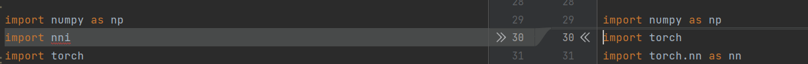

**（2）说明：每次训练完一个epoch向nni报告当前结果；向nni报告最终结果**

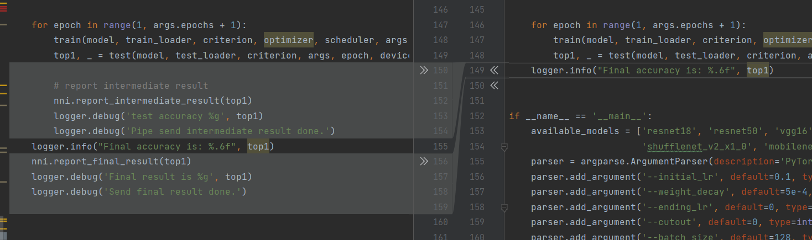

**（3）说明：每次训练完一个参数组合，准备下一个组合**

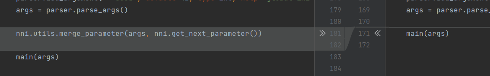

**第一次实验：本地**

**对config.yml的修改：**

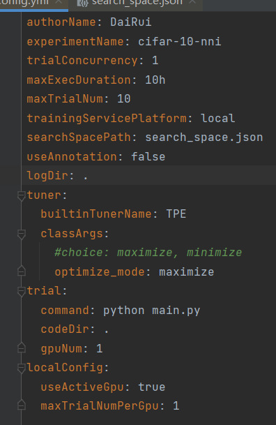

**对search_space.json的修改：**

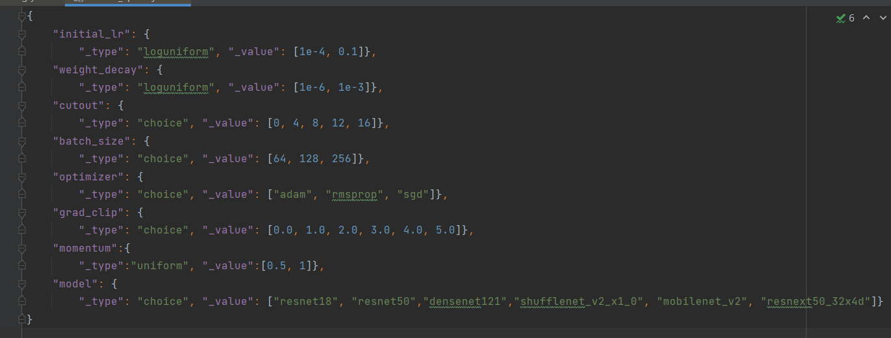

**第二次实验：远程**

**对config.yml的修改：**

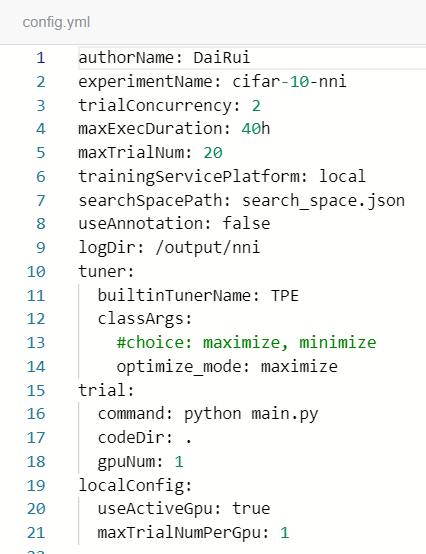

**对search_space.json的修改：**

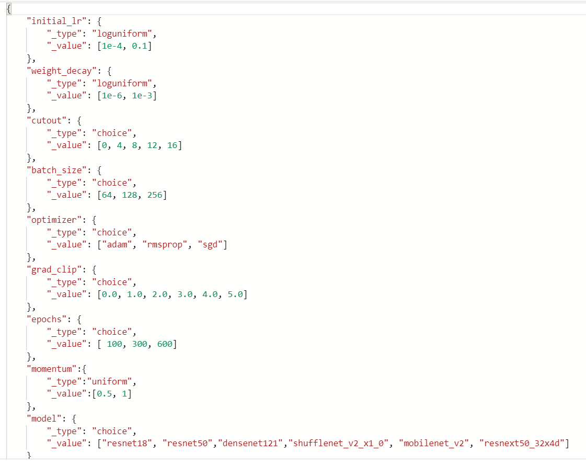

**第三次实验：远程**

**对config.yml的修改：**

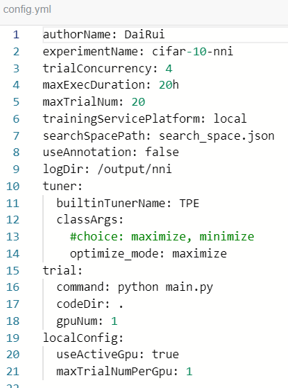

**对search_space.json的修改：**

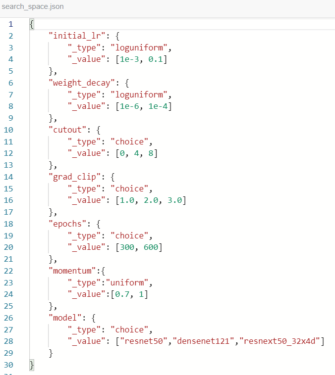

3.提交使用NNI自动调参方式，Web UI上的结果截图。

**由于远程运行NNI没有WebUI，因此这里只放了第一次实验的WebUI结果截图：**

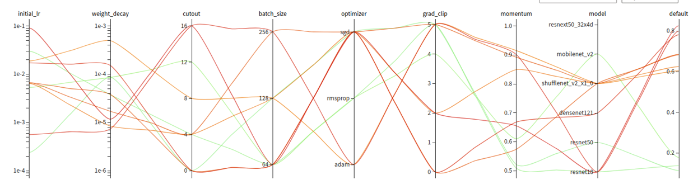

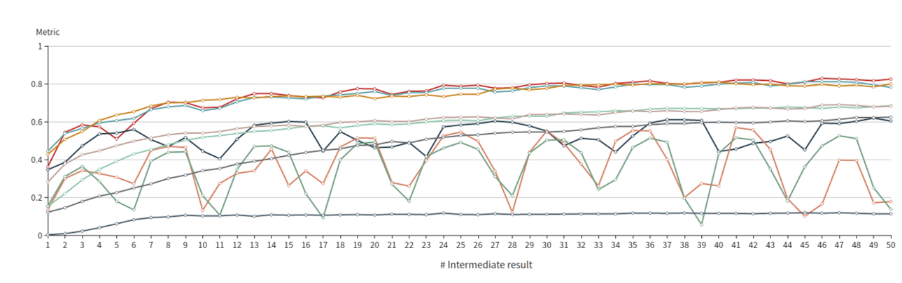

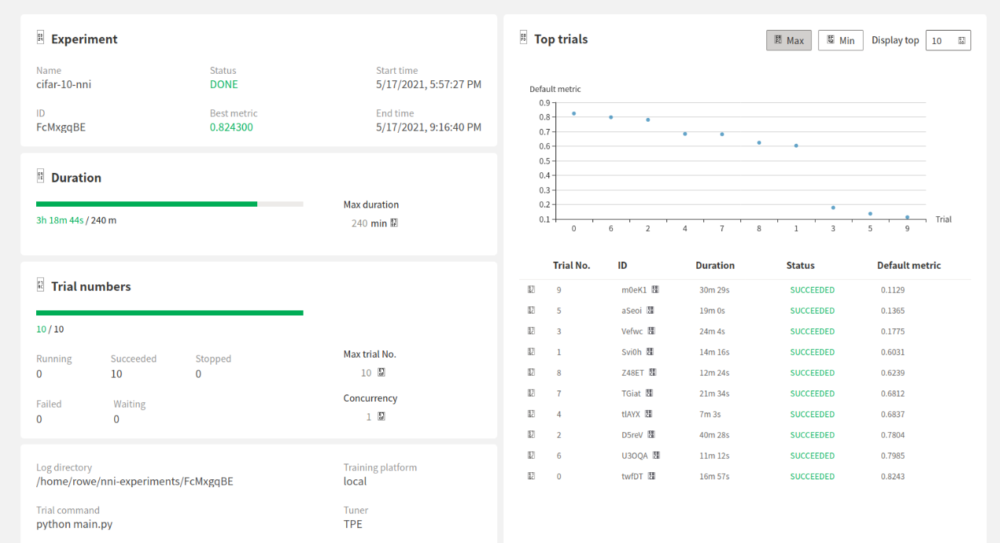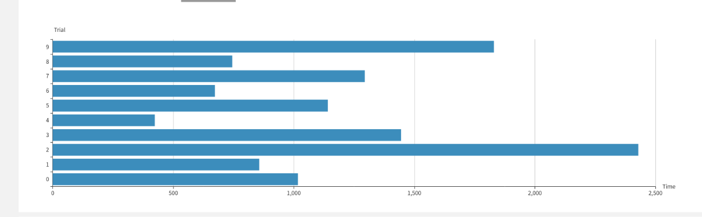

更多截图请看**结果/截图** 文件夹里查看。

**4.实验总结**

在本次实验中，遇到了许多或大或小的问题，也积累了很多有用的经验和心得，都值得一说。

**一，问题：**

**1 .问题描述：**

安装Ubuntu 18.04 LTS
x86_64过程中，制作完安装盘后，进入安装和体验linux时出现花屏死机。

**问题原因：**

是由于硬盘原因，制作安装盘时是使用的是分区而不是一块完整的硬盘，导致引导读取时出现了问题。

**解决方法：**

<https://blog.csdn.net/legalhighhigh/article/details/81448830>

**2.问题描述：**

尝试运行github上提供的hpo-answers，进行初步测试，发生范围溢出报错。

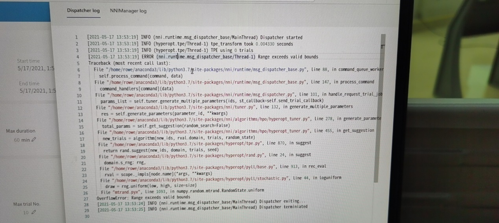

**问题原因**：

经过排查发现，github上提供的hpo-answers的搜索空间文件编写有问题，其中的

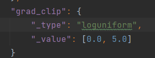

grab_clip参数在等于0时功能不同于其他取值，其功能等价于disable，

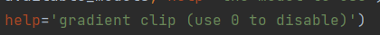

因此不能简单用loguniform来囊括0-values。

**解决方案：**

将**search_space.json中的**grab_clip的type改为choice，或者将0-values单独出来成为一个选择。

**3.问题描述：**

NNI无法使用GPU来运行项目

**问题原因：**

NNI系统默认检查空闲的GPU并使用，因此有时只要你的GPU有哪怕只有1%的占用率NNI系统都不会使用你的GPU

**解决方案：**

**在config.yml中加入以下部分**

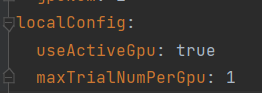

这些代码的作用是强制使用可用的GPU，无论是否占用。

**4.问题描述：**

在Bitahub上使用nni镜像运行项目任务，任务刚启动就直接成功而结束。

**问题原因：**

在nni系统刚启动并准备进行trials时，真正的进程还没有开始，但系统却因为暂时无进程而误认为所有任务已经完成，不等待nni即将到达的命令就直接结束整个任务。

**解决方案：**

在运行命令后加上 && cat

**启动命令变为：**

**mkdir -p /output/nni && nnictl create --config /code/mine/config.yml && cat**

此命令的作用是让整个任务永远不自动结束，只能用户手动结束，因此不会再让系统错误判断并结束项目。

缺点是就算整个项目完成也无法自动结束，需要用户自行判断并手动结束，否则会浪费算力。

**二，经验总结：**

**1，对config.yml和search_space.json的改动经验总结**

**（1）config.yml：中各主要参数的作用**

trialConcurrency: 1

同时进行的trial数

maxExecDuration: 10h

总上限时间，超过这个时间就自动结束。

maxTrialNum: 10

总trial数，完成后自动结束。

logDir: .

输出结果文件的路径

trial:  
command: python main.py  
codeDir: .  
gpuNum: 1

gpuNUm：每个trial所用gpu数量（一般为1）

maxTrialNumPerGpu: 1

每个gpu上所跑的trial数量（建议为1）

事实上，在实验中发现，在单个gpu上并行的跑多个trials并不会有效率提升，总体效率反而会下降。

**2，WebUI使用经验总结**

WebUI的使用非常方便，不仅能随时随地的图形化的查看实验情况，还能临时更改实验的上限时间和trial数，甚至即使整个实验完成，只要未彻底停止实验，也能通过WebUI追加trials以继续运行。还可以详细的看到每一个trial的运行情况，结果曲线。

**3，在Bitahub上使用NNI的使用经验总结**

（1）合适的NNI镜像

感谢苏晨林助教提供的NNI镜像网址： [msranni/nni
(docker.com)](https://hub.docker.com/r/msranni/nni)

这是一个高度集成化的镜像，包含了基本NNI实验所需的所有组件和框架。

但本次实验不适合使用最新版本NNI的镜像，会出现无法启动的错误

推荐使用：v1.8

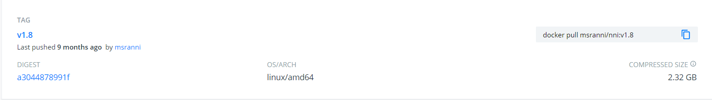

（2）使用Dockerfile来构建镜像

使用Dockerfile文件来构建镜像非常简单，一般只需一行代码即可。

编写Dockerfile文件也同样十分简单，尤其是在镜像创建者贴心地集成所有必须组件的时候，如本次实验构建NNI镜像的Dockerfile：

然后在Bitahub上传构建镜像即可。

**4，在Bitahub上使用NNI后查看结果**

使用*DB Browser for SQLite*打开结果文件夹中db\\nni.sqlite文件

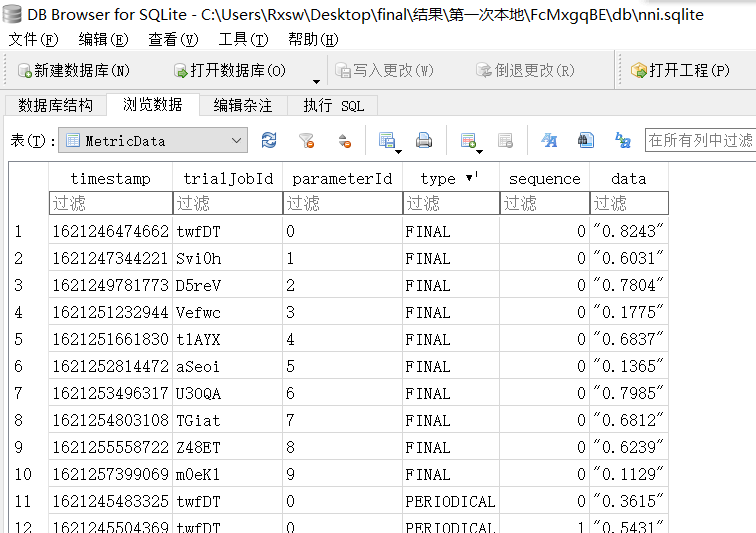

就可以看到整个实验过程中所有的数据，包括准确度（包括过程中的），参数设置等

**5，使用NNI的最终总结：**

**人工调参一直是一件很困难的事，由于如今的深度学习的深层理论架构仍不够完善，人们对每个超参数之间的联系关系仍一知半解，且没有一个系统的方法去得到理想的参数，因此至今人工调参更多依靠的是个人的经验。**

**而NNI则提供了一个减轻人工调参的负担的方法：只需要编写好搜索空间，设置好运行时间和运行进程数量，然后放那里一直运行就可以了。而且NNI在帮你自动调参的同时，可以通过WebUI把可视化的工作一起给做了。**

**通过本次实验，我对NNI有了一些了解，且初步学会了使用NNI进行自动机器学习，NNI中还有更多的功能等我去探索。**
