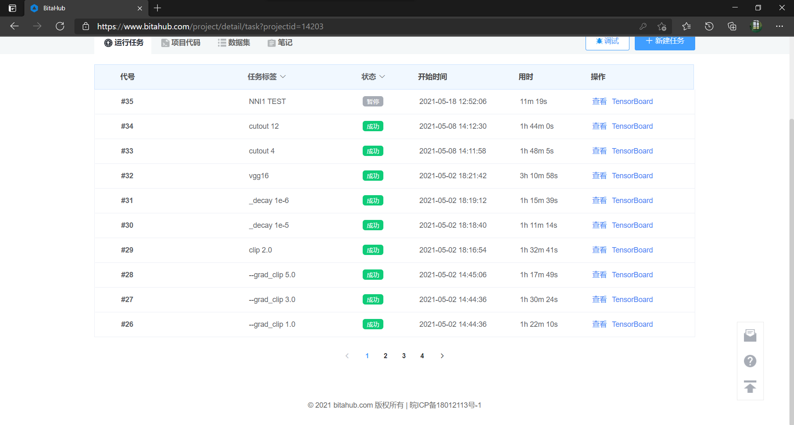
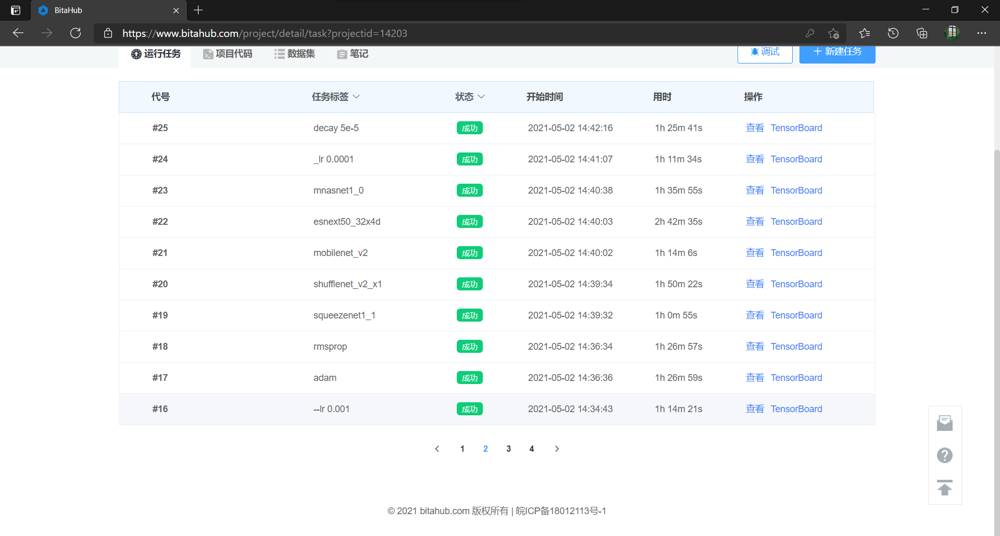
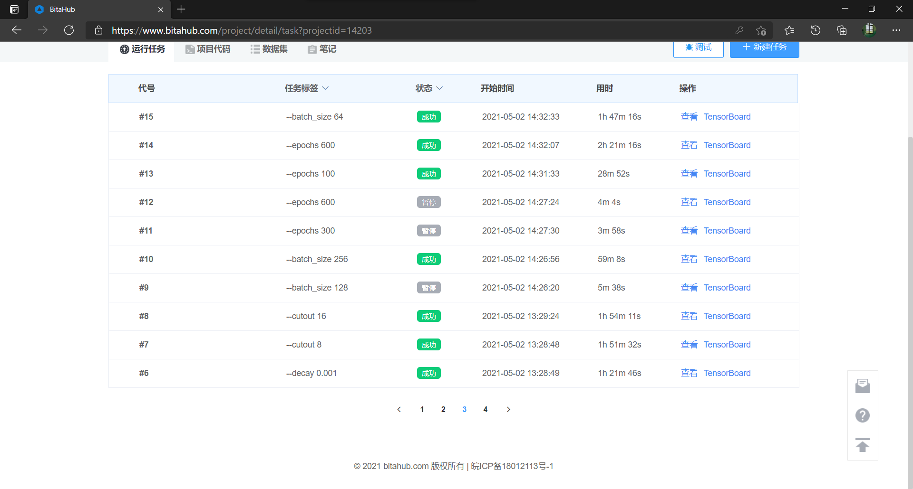
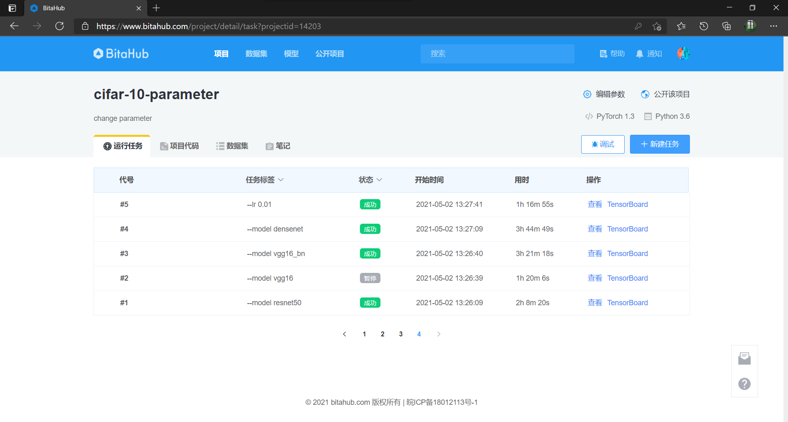
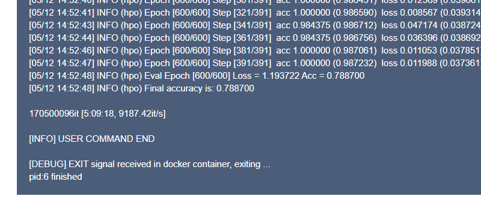
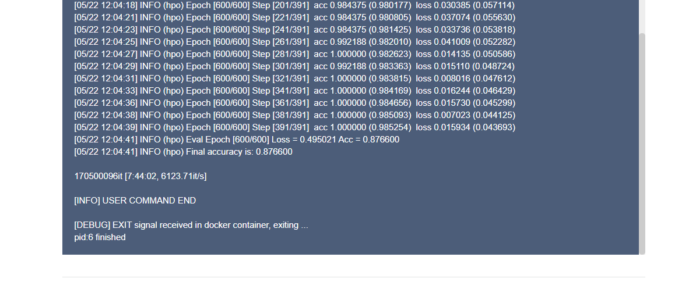
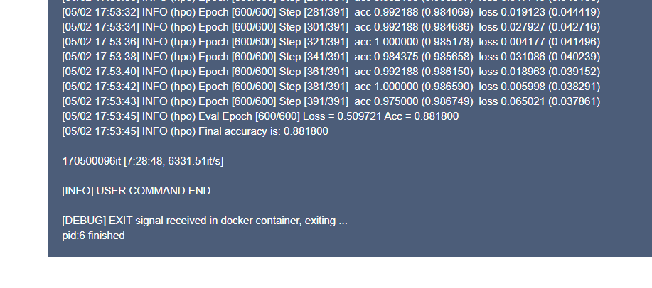

（1）python main.py

\--model resnet50

\--initial_lr 0.01

\--grad_clip 1.0

\--optimizer sgd

\--weight_decay 5e-5

\--cutout 4

\--epochs 600

\--batch_size 128

（2）python main.py

\--model densenet121

\--initial_lr 0.1

\--grad_clip 1.0

\--optimizer sgd

\--weight_decay 5e-5

\--cutout 4

\--epochs 600

\--batch_size 128

（3）python main.py

\--model densenet121

\--initial_lr 0.1

\--grad_clip 1.0

\--optimizer sgd

\--weight_decay 5e-5

\--cutout 0

\--epochs 600

\--batch_size 128

